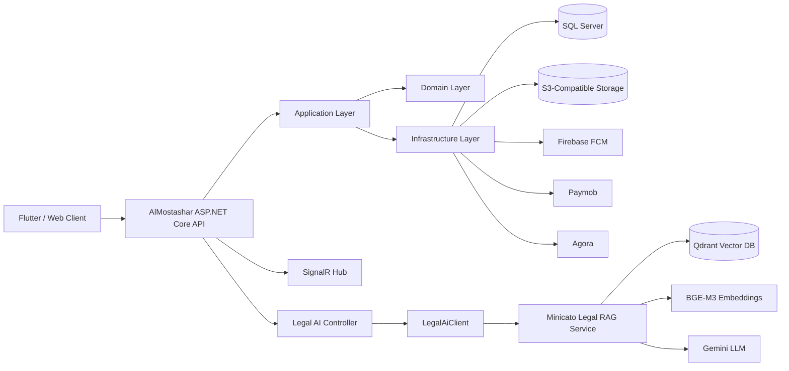
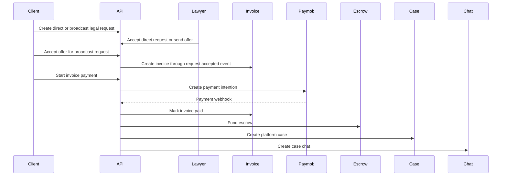
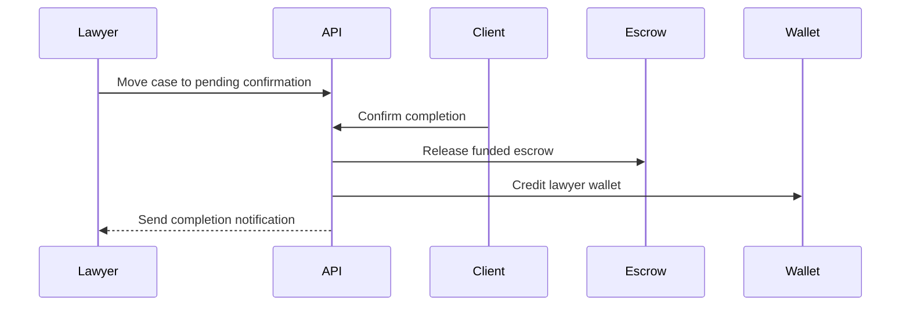
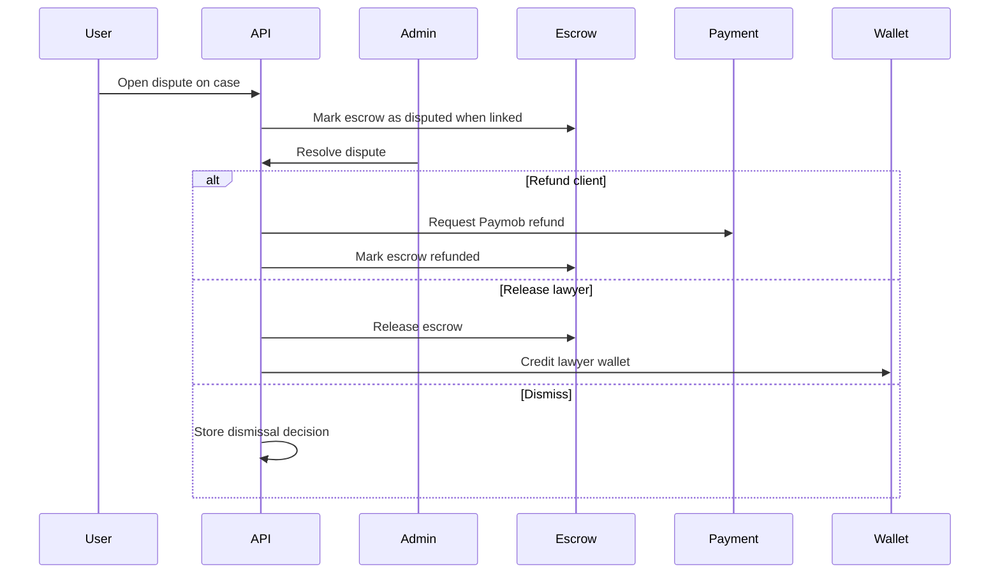
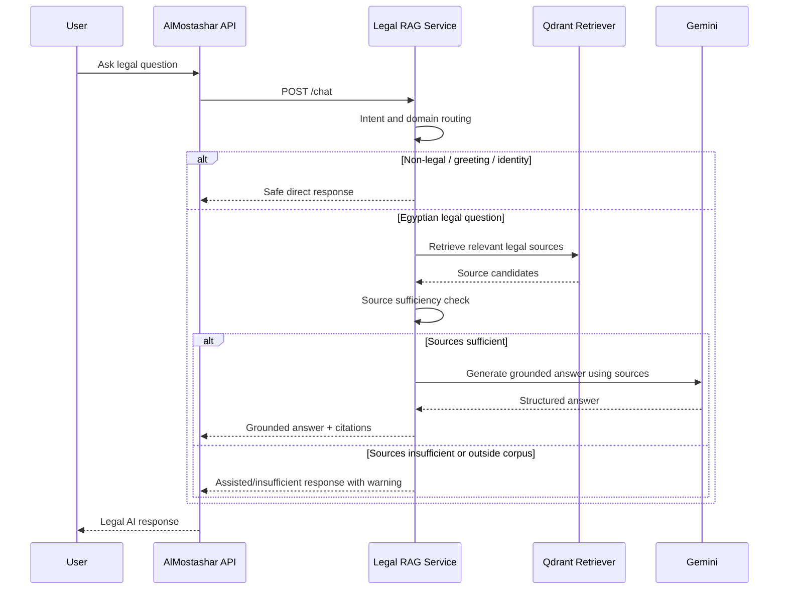

<div align="center">
  <table>
    <tr>
      <td align="center" width="50%">
        
      </td>
      <td align="center" width="50%">
        
      </td>
    </tr>
  </table>

  <h1>Minicato API</h1>

  <p>
    <strong>A graduation project by Faculty of Computers and Informatics, Zagazig University</strong>
  </p>

  <p>
    A scalable legal-services backend platform built with ASP.NET Core, Clean Architecture, real-time communication, payments, escrow, disputes, and an integrated Egyptian Legal RAG intelligence layer.
  </p>
</div>

<div align="center">


</div>

## 1. Overview

Minicato is a legal-services backend platform that connects clients, lawyers, and admins through a structured digital workflow. The API supports legal service discovery, direct and broadcast client requests, lawyer offers, case management, real-time chat, document handling, payments, invoices, escrow, lawyer wallets, disputes, notifications, and retrieval-grounded legal answer generation over curated Egyptian legal sources.

The platform is organized as a layered ASP.NET Core solution with a dedicated API layer, application feature handlers, domain entities/events, infrastructure integrations, automated tests, and a separate Legal RAG worker integrated through a backend gateway.

## 2. 🎓 Graduation Project

Minicato was developed as a graduation project for the Faculty of Computers and Informatics, Zagazig University.

The project focuses on building a real-world legal technology platform that combines software engineering, secure backend design, financial workflows, real-time communication, and AI-assisted legal services.

## 3. Key Features

### Authentication & Authorization

- JWT Bearer authentication.
- Role-based access for clients, lawyers, and admins.
- Client and lawyer registration flows.
- Admin registration and lawyer verification flow.
- Refresh tokens.
- Email verification.
- OTP-based password reset.
- BCrypt password hashing.
- Identity document upload flow for lawyer registration.

### Legal Request Management

- Direct client requests to a selected lawyer service.
- Broadcast requests with client-defined budget.
- Lawyer offers for requests.
- Client offer acceptance and rejection.
- Request statuses such as pending, accepted, in progress, completed, cancelled, and rejected.
- Request-to-invoice and request-to-case flow after acceptance and payment.

### Case Management

- Platform cases linked to client requests.
- External/manual case creation.
- Case statuses including open, in progress, pending confirmation, on hold, closed, dismissed, and canceled.
- Case timeline entries.
- Case notes.
- Case document upload and deletion.
- Client completion confirmation for platform cases.
- Notifications for case updates and completion.

### Financial System

- Paymob payment intention integration.
- Paymob webhook handling with HMAC validation.
- Invoice creation when a request or offer is accepted.
- Payment records with provider metadata and webhook logs.
- Escrow funding after successful invoice payment.
- Escrow release to lawyer wallet.
- Lawyer wallet balance and transaction tracking.
- Admin payment refund endpoint.
- Admin escrow release, refund-state synchronization, and disputed-state operations.

### Disputes

- Client or lawyer can open a dispute on a case.
- Disputes can be linked to the case escrow.
- Funded escrows can be marked as disputed.
- Admin dispute resolution supports:
  - release to lawyer,
  - refund to client,
  - dismissal.
- Admin decisions, notes, reviewer, and resolution timestamp are stored on the dispute record.

### Real-time Communication

- SignalR hub at `/hubs/minicato`.
- Real-time chat between case participants.
- Typing indicators.
- Message read receipts.
- Chat unread counters.
- Agora call token generation.
- Call lifecycle endpoints for generate, accept, reject, and end.
- Background cleanup for missed calls.

### Notifications

- Persisted notification records.
- SignalR notifications for online users.
- Firebase Cloud Messaging fallback for offline users.
- FCM token registration.
- Notification list and mark-as-read APIs.
- Incoming call notifications with high-priority mobile delivery.

### Legal RAG Intelligence Layer

- Authenticated Legal AI gateway exposed by the ASP.NET Core API.
- Separate Egyptian Legal RAG worker/service integrated through `LegalAiClient`.
- Retrieval-Augmented Generation over internal Egyptian legal sources.
- Source sufficiency checks before presenting an answer as internally grounded.
- Answer modes that distinguish identity, conversation, non-legal, grounded, assisted, external-assisted, and insufficient responses.
- Configurable timeout, cache, internal token header, and warmup support.
- Sanitized service-unavailable handling from the main API.

### Storage & Documents

- S3-compatible storage integration.
- File upload support.
- Presigned URL generation.
- File deletion flow.
- Case and request document support.

## 4. 🧠 Egyptian Legal AI Knowledge Engine

AlMostashar integrates with a dedicated Egyptian Legal RAG engine rather than treating AI as a generic chatbot. The main backend exposes authenticated Legal AI endpoints and delegates legal answer generation to a separate Python/FastAPI worker through `LegalAiClient`.

This AI layer retrieves relevant Egyptian legal materials before answer generation, evaluates whether the retrieved sources are sufficient, and returns responses that make the grounding level explicit. When internal sources are enough, the response can be presented as grounded. When a question is outside the current corpus or source coverage is not enough, the system avoids pretending that unsupported answers are internally verified.

> Legal AI responses are designed to support legal understanding, not replace professional legal advice. The system distinguishes between internally grounded answers and assisted explanations, and it avoids presenting unsupported answers as verified legal citations.

### 🔎 Minicato Legal RAG Service

The Legal AI capability is powered by a dedicated Python/FastAPI service:

[Minicato Legal RAG API](https://github.com/Loay-Wael1/al-mostashar-legal-rag)

This service acts as the Egyptian legal knowledge engine behind the platform. It is not a generic chatbot; it uses Retrieval-Augmented Generation to retrieve relevant Egyptian legal materials, evaluate whether the retrieved sources are sufficient, and then generate an answer grounded in those sources.

Confirmed capabilities from the RAG service include:

- FastAPI service with public `/health`, `/legal-info`, and compact `/chat` endpoints.
- Hidden/debug endpoints such as `/legal-answer`, `/embed`, `/embed/batch`, and `/info`.
- BGE-M3 embeddings through a local embedding model configuration.
- Qdrant vector database for legal retrieval.
- Gemini through an OpenAI-compatible Chat Completions API.
- Arabic legal text normalization before routing, retrieval, and cache lookup.
- Intent routing before retrieval for identity, conversation, non-legal, legal retrieval, and out-of-corpus legal topics.
- Domain routing for labor law, civil law, criminal law, and constitutional law.
- Source sufficiency gate based on usable sources, domain clarity, law clarity, score, overlap, conflicts, and exact article signals.
- Flutter-friendly compact `/chat` response with answer mode, final answer, warning, source citations, and LLM metadata.
- Safe public error handling that strips internal LLM diagnostics unless debug metadata is enabled.
- In-memory response caching for deterministic or successfully generated safe chat responses.
- Lazy model/retriever loading with `/warmup` support for cold starts.

### Answer Modes

| Mode | Meaning |
| --- | --- |
| `identity` | Answers questions about the assistant identity without retrieval or LLM generation. |
| `conversation` | Handles greetings and conversational messages without retrieval or LLM generation. |
| `non_legal` | Rejects non-legal queries safely. |
| `grounded` | Answer generated from sufficient internal legal sources. |
| `assisted` | Combines available internal sources with assisted explanation when grounding is partial. |
| `external_assisted` | Handles Egyptian legal topics outside the internal corpus with a clear warning. |
| `insufficient` | Avoids unsupported legal claims when internal sources are not enough. |

This mode design is a trust and safety boundary: the response tells clients whether the answer is internally grounded, assisted, outside the current corpus, or unsupported by enough internal sources.

### Current Internal Legal Corpus

The current internal corpus includes:

- Egyptian Labor Law.
- Egyptian Civil Law.
- Egyptian Penal Code.
- Egyptian Constitution.

Some legal areas, such as family law and personal status topics, are treated as outside the current internal corpus and returned with explicit warnings instead of fake citations.

## 5. Architecture



### Layers

| Layer | Responsibility |
| --- | --- |
| `AlMostashar.Api` | HTTP controllers, Swagger/OpenAPI, CORS, request localization, SignalR hub, API services, middleware, and web entry point. |
| `AlMostashar.Application` | Feature-based commands, queries, DTOs, validators, MediatR handlers, application interfaces, transaction pipeline, and domain event handlers. |
| `AlMostashar.Domain` | Core entities, domain events, shared result/error models, enums, and case factory logic. |
| `AlMostashar.Infrastructure` | EF Core DbContext, SQL Server configuration, migrations, storage, payment provider, JWT/auth, email, Firebase, Agora, Legal AI gateway client, and hosted services. |
| `AlMostashar.Application.Tests` | xUnit test project covering application behavior, auth/account state, requests, offers, payments, webhooks, escrow, wallet, notifications, Legal AI, and validation. |

The application uses MediatR for feature orchestration, FluentValidation for request validation, EF Core for persistence, and domain events for workflows such as invoice creation, case creation, chat creation, notifications, and escrow funding.

## 6. Main Workflows

### Client Request to Case



### Case Completion



### Dispute Resolution



### Legal RAG Answering Flow



## 7. Tech Stack

| Area | Technology |
| --- | --- |
| Framework | ASP.NET Core 8 |
| Language | C# |
| Database | SQL Server |
| ORM | Entity Framework Core |
| Architecture | Clean Architecture / Layered Architecture |
| CQRS / Mediator | MediatR |
| Validation | FluentValidation |
| Auth | JWT Bearer, BCrypt |
| API Docs | Swagger / OpenAPI |
| Real-time | SignalR |
| Push Notifications | Firebase Cloud Messaging |
| Storage | S3-compatible storage via AWS S3 SDK |
| Payments | Paymob |
| Calls | Agora |
| Background Services | Hosted services for Legal AI warmup and missed-call cleanup |
| Testing | xUnit, Moq, EF Core SQLite |

### AI / RAG Stack

| Area | Technology |
| --- | --- |
| Legal AI Worker | Python / FastAPI |
| Retrieval | Qdrant |
| Embeddings | BGE-M3 |
| LLM Provider | Gemini via OpenAI-compatible API |
| AI Pattern | Retrieval-Augmented Generation |
| AI Safety | Source sufficiency gate, answer modes, sanitized errors |

## 8. Project Structure

```text
AlMostashar.Api/
  Controllers/
  DTOs/
  Helpers/
  LocationCatalog/
  Middlewares/
  Services/
  SignalR/
  Program.cs

AlMostashar.Application/
  Common/
  Features/
  Helpers/

AlMostashar.Domain/
  Entities/
    Cases/
    Chat/
    Common/
    Engagement/
    Financial/
    Requests/
    Services/
    Users/
  Events/
  Shared/
  ValueObject/

AlMostashar.Infrastructure/
  Data/
    Configurations/
  Helpers/
  Migrations/
  Options/
  Services/

AlMostashar.Application.Tests/
  TestSupport/
```

## 9. Getting Started

### Prerequisites

- .NET 8 SDK.
- SQL Server.
- EF Core CLI tools for database migrations.
- Provider credentials for Paymob, Firebase, S3-compatible storage, Agora, email, and Legal AI when running the full integration surface.

### Restore and Build

```bash
git clone <repo-url>
cd almostashar-api
dotnet restore
dotnet build
```

### Database

```bash
dotnet ef database update --project AlMostashar.Infrastructure --startup-project AlMostashar.Api
```

### Run the API

```bash
dotnet run --project AlMostashar.Api
```

### Swagger

```text
https://localhost:<port>/swagger
```

Swagger is enabled when the API runs in the Development environment.

## 10. Configuration

Use environment variables, user secrets, or a secure secret store for real values. Do not commit production secrets.

```json
{
  "ConnectionStrings": {
    "AlmostasharSqlServer": "Server=...;Database=...;User Id=...;Password=...;TrustServerCertificate=True"
  },
  "Jwt": {
    "Secret": "your-secure-jwt-secret",
    "Issuer": "your-issuer",
    "Audience": "your-audience",
    "ExpiryMinutes": 1440,
    "RefreshTokenExpiryDays": 7
  },
  "Otp": {
    "Length": 6,
    "ExpiryMinutes": 5
  },
  "PaymobSettings": {
    "SecretKey": "your-paymob-secret-key",
    "PublicKey": "your-paymob-public-key",
    "IntegrationId": 0,
    "PaymentMethodIds": [0],
    "IntentionApiUrl": "https://...",
    "CheckoutBaseUrl": "https://...",
    "RedirectionUrl": "https://...",
    "RefundApiUrl": "https://...",
    "HMAC": "your-paymob-hmac-secret"
  },
  "Storage": {
    "S3": {
      "Endpoint": "https://...",
      "Region": "auto",
      "BucketName": "your-bucket",
      "AccessKey": "your-access-key",
      "SecretKey": "your-secret-key"
    }
  },
  "Firebase": {
    "ServiceAccountKey": "{...}"
  },
  "Agora": {
    "AppId": "your-agora-app-id",
    "Certificate": "your-agora-certificate",
    "TokenExpirationSeconds": 3600
  },
  "Email": {
    "SmtpHost": "smtp.example.com",
    "SmtpPort": 587,
    "Username": "your-email-user",
    "Password": "your-email-password",
    "FromEmail": "noreply@example.com",
    "FromName": "AlMostashar"
  },
  "LegalAi": {
    "BaseUrl": "https://your-legal-rag-service/",
    "ApiKey": "your-internal-service-token-if-used",
    "HeaderName": "X-Internal-Service-Token",
    "TimeoutSeconds": 120,
    "WarmupOnStartup": false,
    "WarmupDelaySeconds": 5,
    "CacheEnabled": true,
    "CacheDurationMinutes": 10
  }
}
```

The Python Legal RAG service uses its own environment variables. Use placeholders only:

```env
GEMINI_API_KEY=your_key_here
GEMINI_BASE_URL=https://generativelanguage.googleapis.com/v1beta/openai/
GEMINI_MODEL=gemini-2.5-flash
API_PORT=8000
PRELOAD_RETRIEVER=false
CHAT_CONCISE_ANSWERS=true
CHAT_RESPONSE_CACHE_SIZE=128
CHAT_ANSWER_TOP_K=3
DEBUG_RESPONSE_METADATA=false
```

## 11. API Modules

- Auth
- Admin
- Admin Payments
- Admin Escrows
- Admin Disputes
- Clients
- Client Home
- Client Profile
- Client Requests
- Lawyer Home
- Lawyer Requests
- Lawyers
- Lawyer Services
- Lawyer Wallet
- Legal Services
- Cases
- Chats
- Documents
- Payments
- Request Escrows
- Disputes
- Notifications
- Reports
- Feedback
- Legal AI
- Lookups

### Legal AI Gateway

The main ASP.NET Core API exposes authenticated Legal AI endpoints:

- `POST /api/legal-ai/chat`
- `GET /api/legal-ai/info`
- `GET /api/legal-ai/health`
- `POST /api/legal-ai/warmup` admin-only

Internally, the backend calls the Python RAG service through `LegalAiClient`. The gateway client uses configured base URL and timeout values, optional `IMemoryCache` response caching, an optional internal service token header, a warmup endpoint, and sanitized service-unavailable handling for public API responses.

## 12. Testing

Run the test suite with:

```bash
dotnet test
```

The test project includes coverage for:

- Authentication and account state.
- Current user resolution.
- Client request creation and querying.
- Direct and broadcast offer flows.
- Governorate and city validation.
- Location lookup catalog behavior.
- Payment webhook behavior.
- Paymob service behavior.
- Invoice, event, escrow, and wallet workflows.
- Case completion flow.
- Notifications.
- Legal AI integration boundaries.
- Lawyer profile updates.

The separate Legal RAG repository also includes Python tests for API startup, `/chat`, `/legal-info`, intent routing, answer modes, retrieval, normalization, LLM parsing, and warmup behavior.

## 13. Security Notes

- Never commit real secrets, API keys, service account JSON, database passwords, or payment credentials.
- Use environment variables, user secrets, or a managed secret store for sensitive configuration.
- Restrict CORS origins before production deployment.
- Enforce HTTPS in all deployed environments.
- Keep S3-compatible buckets private and serve files through controlled presigned URLs.
- Rotate any credential that has ever been exposed publicly.
- Protect Paymob webhook HMAC secrets and validate webhook signatures.
- Protect Firebase service account credentials.
- Keep JWT secrets long, random, and rotated.
- Protect the internal Legal AI service token when enabled.
- Review admin-only financial endpoints carefully before production exposure.

## 14. Roadmap

- Production-grade CORS policy.
- Stronger rate limiting and abuse protection.
- Outbox pattern for financial and notification events.
- Enhanced observability with structured logs, tracing, and metrics.
- Expanded integration tests around payments, escrow, disputes, chat, storage, and Legal RAG gateway behavior.
- Improved secure document access controls.
- CI/CD hardening with automated build, test, and migration checks.
- More granular admin audit trails for sensitive financial decisions.

## 15. 👥 Team / Credits

Developed as a graduation project by students of the Faculty of Computers and Informatics, Zagazig University.

Backend Engineering: AlMostashar API Team
